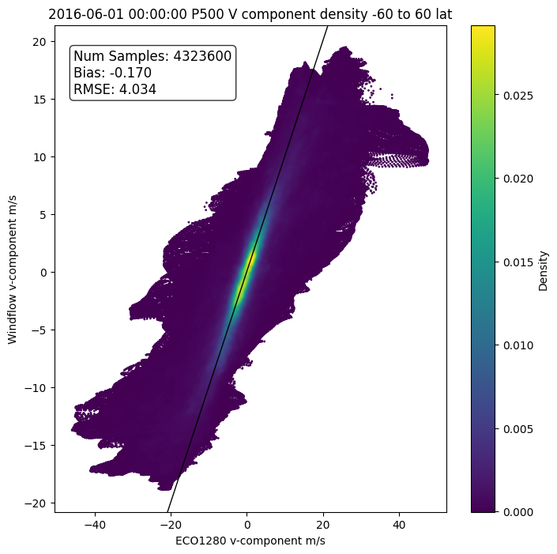

# windflow-light 

## Overview
Predicting wind speeds using optical flow inference on ECO1280 radiance data from a pretrained RAFT model, and a model trained on the 500 millibar layer with a 3-hour time increment.

See  `python predict.py` for a basic example.

### Install

`conda env create -f environment_cpu.yml`

### Humidity Data

`gp_2016-06-01_00:00:00_P500_out.nc`

of the form `gp_yyyy-mm-dd_HH:MM:SS_P[pressurelvl]_out.nc`

fields:

| Field | long name |
| --- | --- |
| gp_newP | specific humidity |
| lev_p | pressure level |
| lat_0 | latitude |
| lon_0 | longitude |

### UV Components:

`uv_2016-06-01_00:00:00_P500_out.nc`

of the form `uv_yyyy-mm-dd_HH:MM:SS_P[pressure level]_out.nc`

fields:

| Field | long name |
| --- | --- |
| ugrd_newP | U component of wind |
| vgrd_newP | V component of wind |
| lat_0 | latitude |
| lon_0 | longitude |
| lev_p | pressure level |

latitude, longitude, and pressure level are the same in both of these files. 

### eco1280_loader.py

1. Read in UV Component file; extract and return lat, lon, u and v comp. 

### run_windflow.py

1. Read in Humidity file; extract humidity data, scale  or perform preprocessing if necessary ( This particular example scales by 25000 since the ECO1280 data was scaled by that amount. We want our humidity values to be in the 0 to 255 range)
2. Load model checkpoint. Set the tile size and overlap: Larger tile size should result in increased accuracy(and computation cost). Overlap is currently at 25% of tile size.
3. Perform inference on the model with the humidity data. The preprocessed humidity data is fed into the model to compute flows between the two time steps. This produces predictions for the u and v in units of **m/s**.

### Results

Inferred wind vectors (red) with the truth data (black) over a 3 hour time window.

 
## Citation

Vandal, T., Duffy, K., McCarty, W., Sewnath, A., & Nemani, R. (2022). Dense feature tracking of atmospheric winds with deep optical flow, Proceedings of the 28th ACM SIGKDD Conference on Knowledge Discovery and Data Mining.

## Acknowledgements

External packages and flownet code was used from: https://github.com/celynw/flownet2-pytorch/  
Funded by NASA ROSES Earth Science Research from Geostationary Satellite Program (2020-2023)
