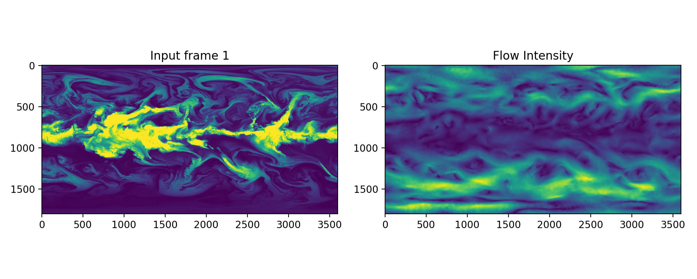

# windflow-light 

Perform optical flow inference on geostationary satellite images from a pretrained RAFT model. 

See  `python predict.py` for a basic example.

## Install

`conda env create -f environment_cpu.yml`

## Usage

Usage for applying pretrained model to ECO1280 data

### contour.py

Plot and compare wind vectors derived from the ECO1280 data with those inferred from the windflow model.

`gp_2016-06-01_00:00:00_P500_out.nc`

of the form `gp_yyyy-mm-dd_HH:MM:SS_P[pressurelvl]_out.nc`

fields:

| Field | long name |
| --- | --- |
| gp_newP | specific humidity |
| lev_p | pressure level |
| lat_0 | latitude |
| lon_0 | longitude |

UV Components:

`uv_2016-06-01_00:00:00_P500_out.nc`

of the form `uv_yyyy-mm-dd_HH:MM:SS_P[pressure level]_out.nc`

fields:

| Field | long name |
| --- | --- |
| ugrd_newP | U component of wind |
| vgrd_newP | V component of wind |
| lat_0 | latitude |
| lon_0 | longitude |
| lev_p | pressure level |

latitude, longitude, and pressure level are the same in both of these files. 

### eco1280_loader.py

1. Read in UV Component file; extract lat, lon, u and v comp. 
2. Read in Humidity file; extract humidity data, scale  or perform preprocessing if necessary ( This particular example scales by 25000 since the ECO1280 data was scaled by that amount. We want our humidity values to be in the 0 to 255 range)

### run_windflow.py

1. Load model checkpoint. 
2. perform inference on the model with the humidity data. The preprocessed humidity data is fed into the model to compute flows between the two time steps. This produces predictions for the u and v in units of **pixels displacement**
3. Convert pixel displacement to v component in units of m/s. Since these images are 3 hours apart, you divide by 3 * 60 * 60 = 10800 to get units of seconds. 
$$
\text{vcomp} = \text{vpixel}~ \cdot ~\frac{0.1 ~\text{deg}}{1 ~\text{pixel}} ~ \cdot ~ \frac{111 ~ \text{km}}{1 ~ \text{degree}} ~ \cdot ~ \frac{1000m}{\text{km}} ~ \cdot ~ \frac{1}{10800\text{sec}}
$$
    
    remember to negate vpixel before doing this. 

$$
\text{ucomp} = \cos(lat) ~ \cdot ~ \text{upixel}~ \cdot ~\frac{0.1 ~\text{deg}}{1 ~\text{pixel}} ~ \cdot ~ \frac{111 ~ \text{km}}{1 ~ \text{degree}} ~ \cdot ~ \frac{1000m}{\text{km}} ~ \cdot ~ \frac{1}{10800\text{sec}}
$$

4. Data is saved to data.nc for later use.

### scatter.py

1. Read in UV file and Humidity file
2. Create a mask for regions of interest (-30 to 30, or -60 to 60, -90 to 90)

There is density scatter, normal scatter, and plots with difference between real u/v and computed u/v. 

### humidity.py

Compare the inferred wind vectors (red) with the truth data (black) over a 3 hour time window.
 
## Citation

Vandal, T., Duffy, K., McCarty, W., Sewnath, A., & Nemani, R. (2022). Dense feature tracking of atmospheric winds with deep optical flow, Proceedings of the 28th ACM SIGKDD Conference on Knowledge Discovery and Data Mining.

## Acknowledgements

External packages and flownet code was used from: https://github.com/celynw/flownet2-pytorch/  
Funded by NASA ROSES Earth Science Research from Geostationary Satellite Program (2020-2023)
